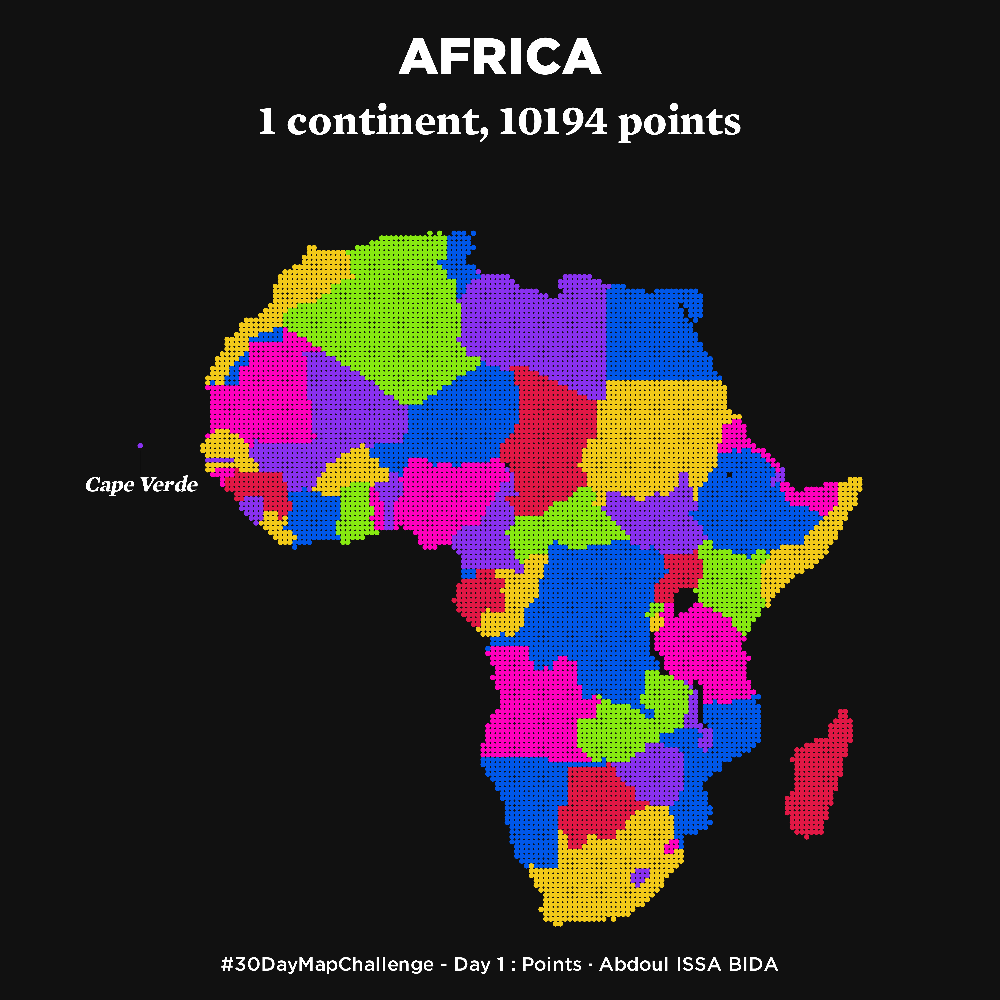
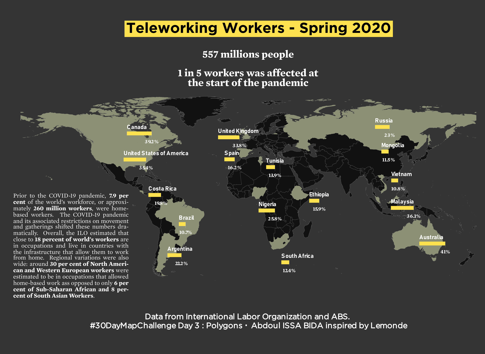
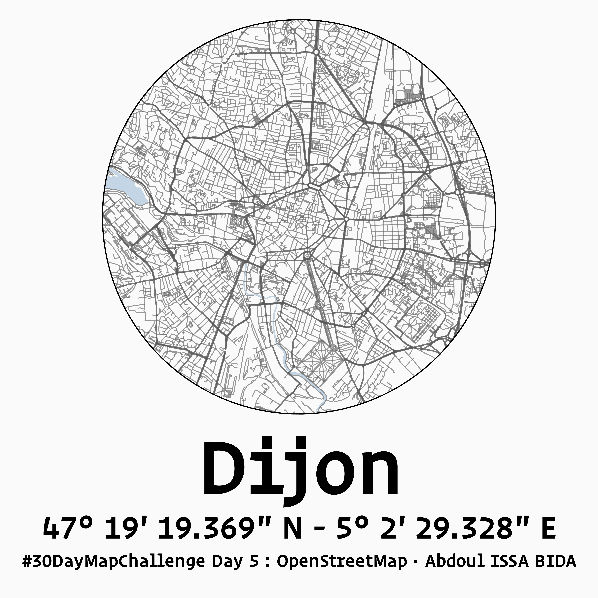

# #30DayMapChallenge 🌎🌏🌎

Code and plots of the submissions to the [#30DayMapChallenge](https://github.com/tjukanovt/30DayMapChallenge) 

___
## Day 1 - Points

# ___
# ## Day 2 - Lines
# 
# 
# 
# ___
# ## Day 3 - Polygons
# 
# 
# 
# ___
# ## Day 4 - Hexagons
# 
# 
# 
# ___
# ## Day 5 - OpenStreetMap
# 
# 