# #30DayMapChallenge 🌎🌏🌎

Code and plots of the submissions to the [#30DayMapChallenge](https://github.com/tjukanovt/30DayMapChallenge) 

___
## Day 1 - Points

<a href="Day1">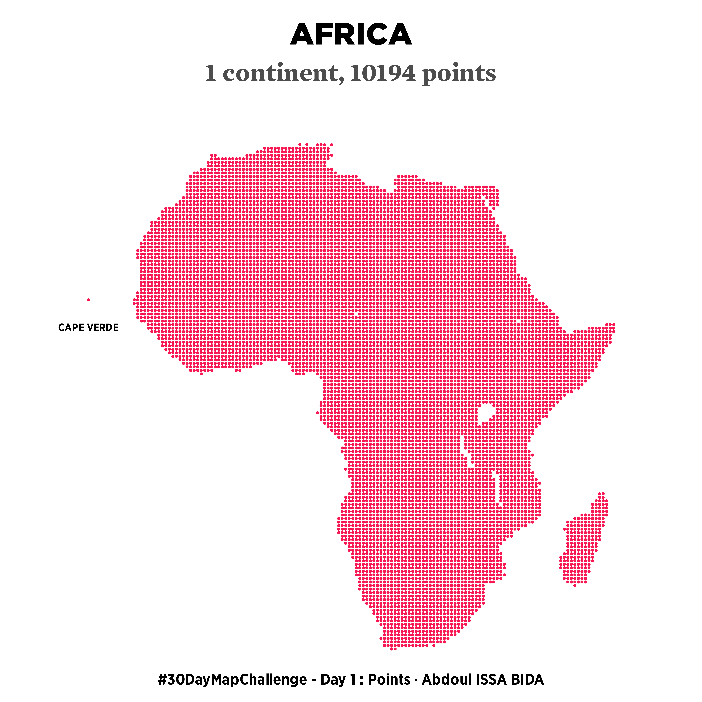</a>

___
## Day 2 - Lines

___
## Day 3 - Polygons

<a href="Day3">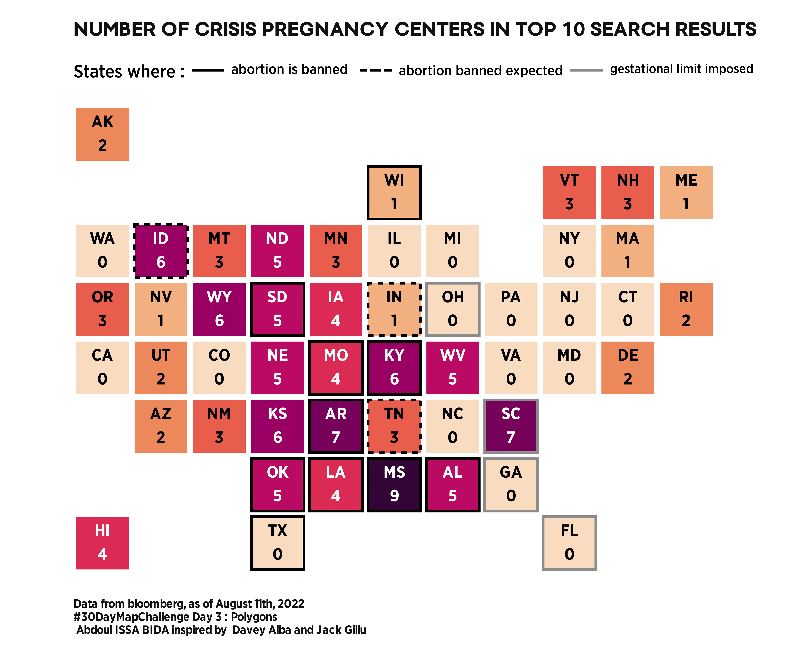</a>

___
## Day 4 - Colour Friday: Green

<a href="Day4">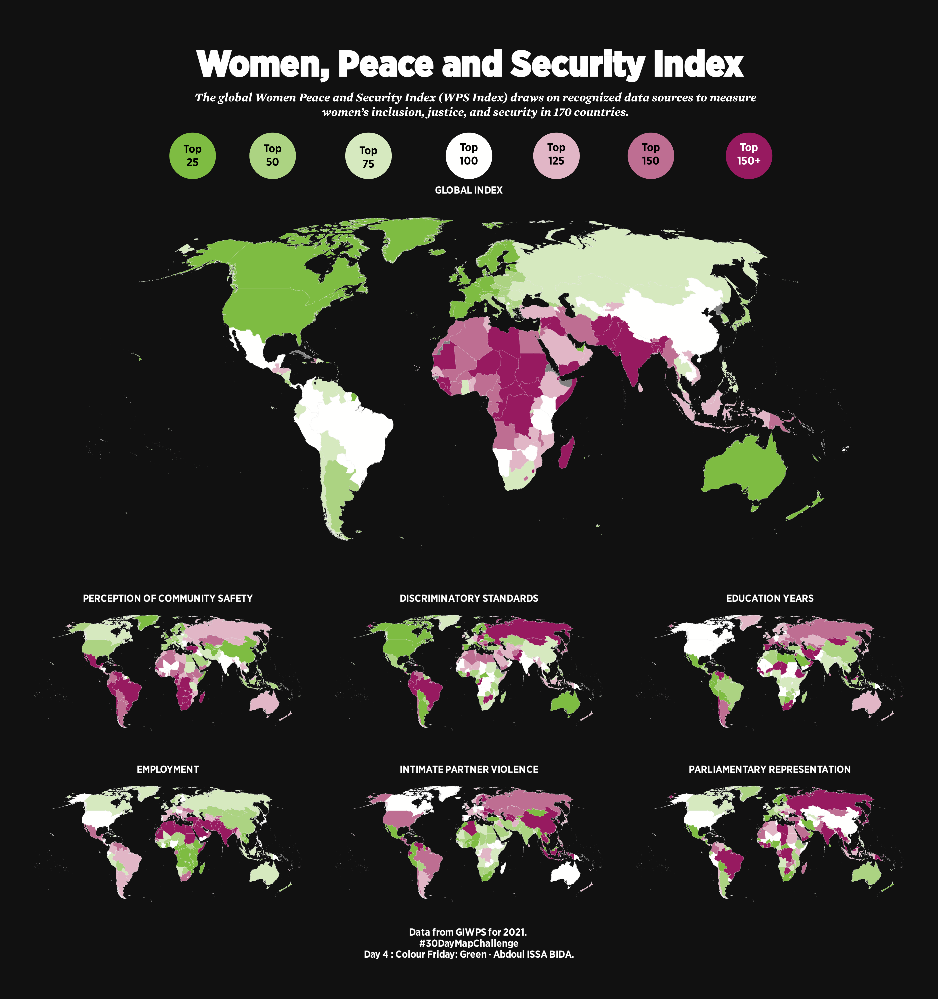</a>

___
## Day 5 - Ukraine

<a href="Day5">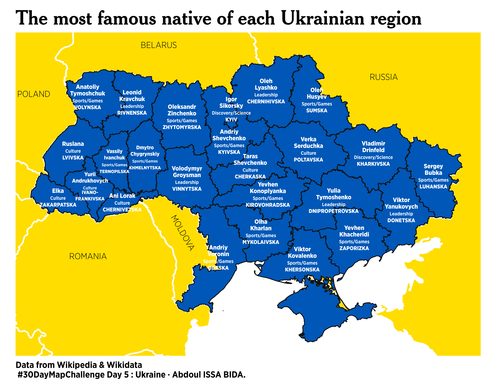</a>

___
## Day 6 - Network

<a href="Day6">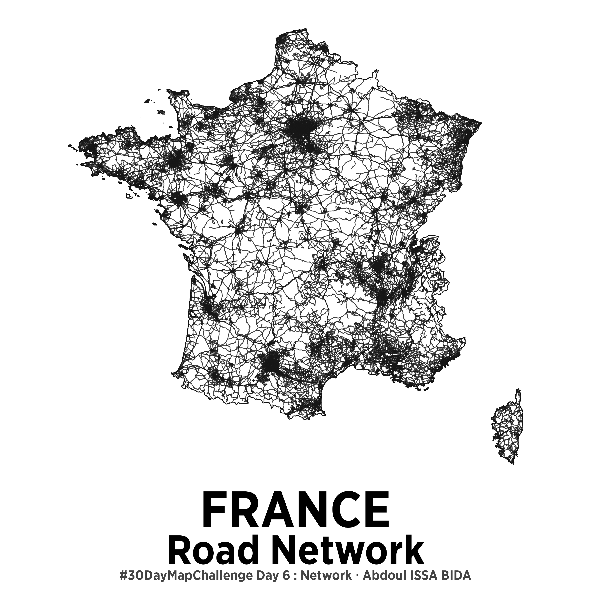</a>

___
## Day 7 - Raster

<a href="Day7">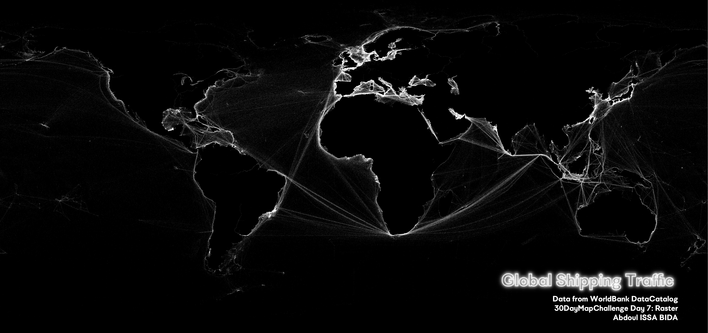</a>

___
## Day 8 - OpenStreetMap

<a href="Day8">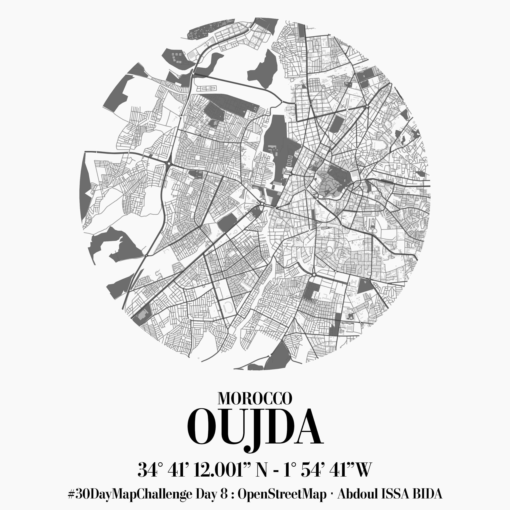</a>

___
## Day 9 - Space

<a href="Day9">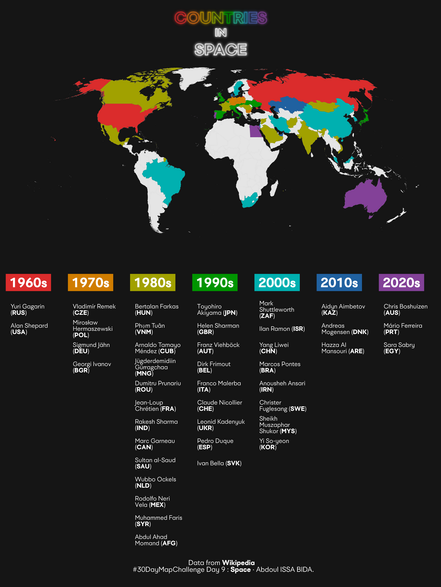</a>

___
## Day 10 - Bad Map

<a href="Day10">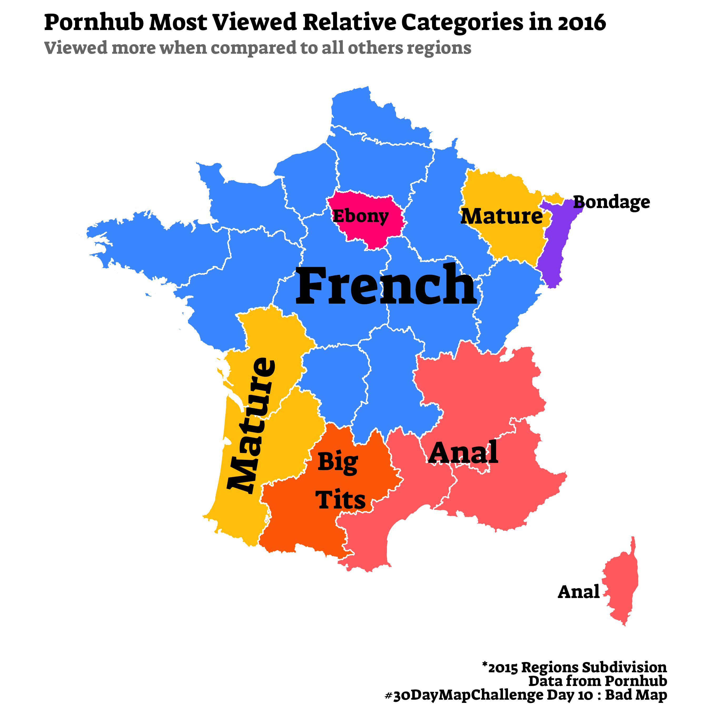</a>

___
## Day 11 - Red

<a href="Day11">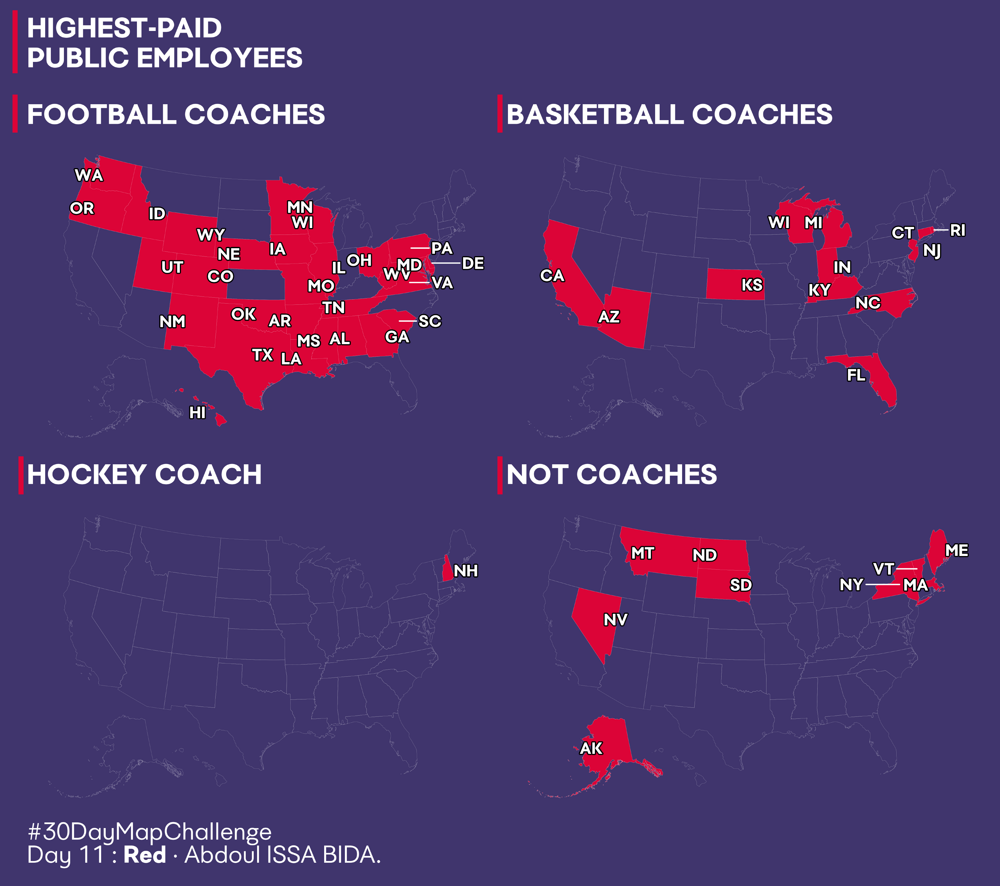</a>

___
## Day 12 - Scale

<a href="Day12">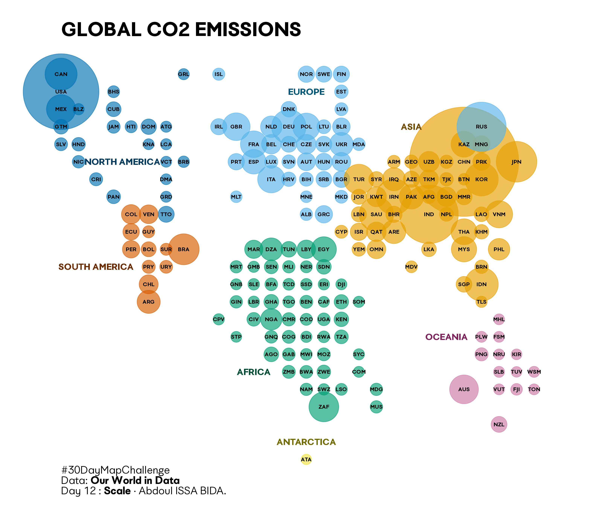</a>

___
## Day 12 - 5 minute map

<a href="Day13">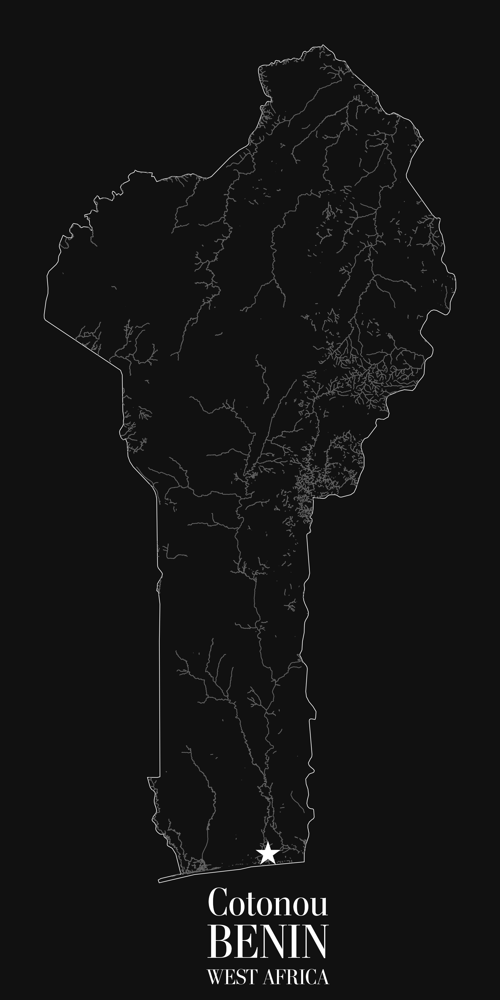</a>
