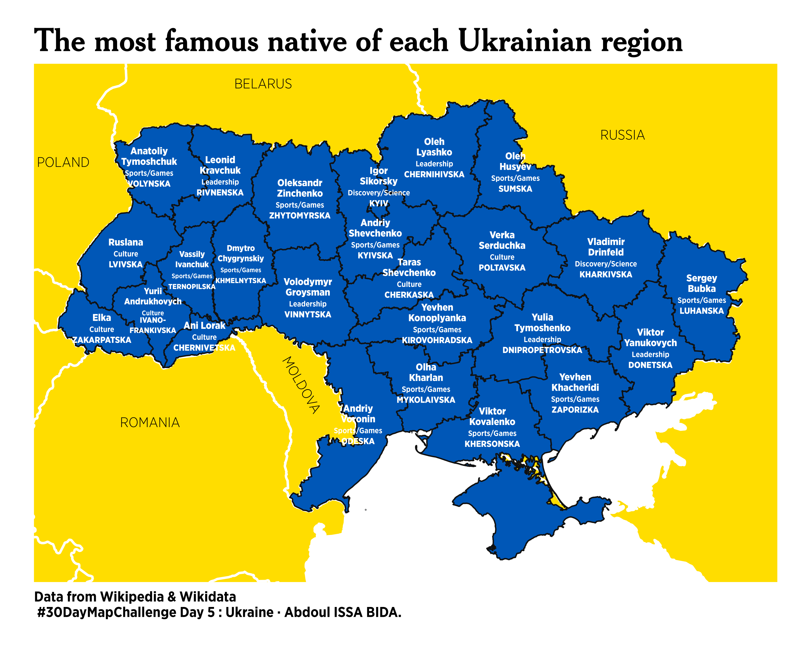
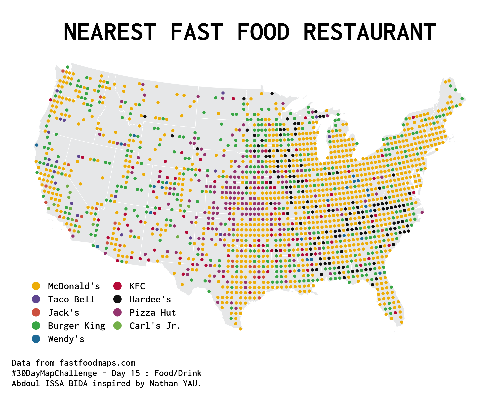
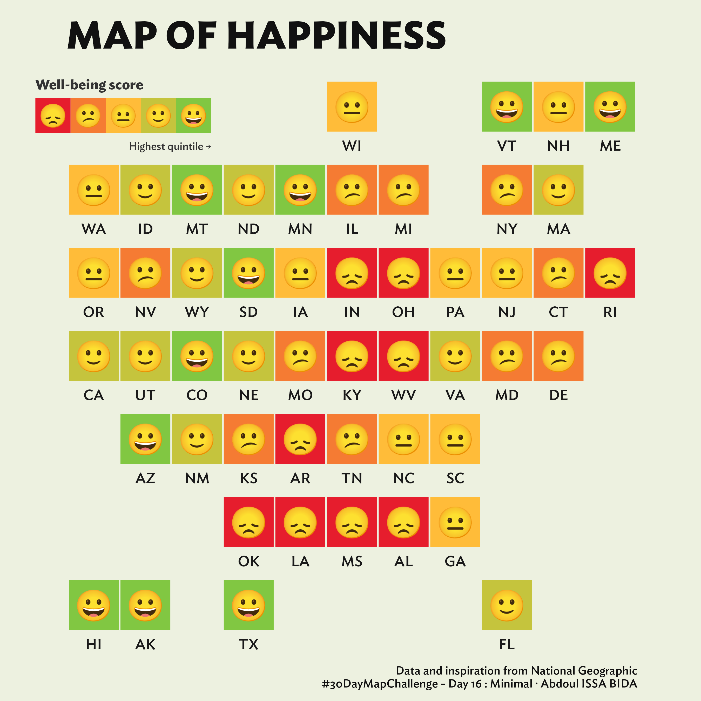
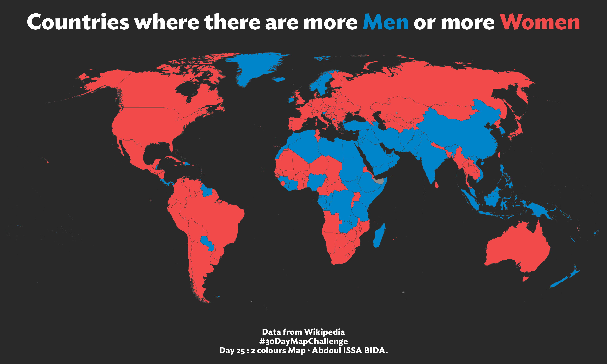

# #30DayMapChallenge 🌎🌏🌎

Code and plots of the submissions to the [#30DayMapChallenge](https://github.com/tjukanovt/30DayMapChallenge) 

___
## Day 1 - Points

___
## Day 2 - Lines

___
## Day 3 - Polygons

___
## Day 4 - Colour Friday: Green

___
## Day 5 - Ukraine

___
## Day 6 - Network

___
## Day 7 - Raster

___
## Day 8 - OpenStreetMap

___
## Day 9 - Space

___
## Day 10 - Bad Map

___
## Day 11 - Red

___
## Day 12 - Scale

___
## Day 13 - 5 minute map

___
## Day 14 - Hexagons

___

## Day 15 - Food/Drink

___

## Day 16 - Minimal

___

## Day 17 - Map without a computer

___

## Day 20 - My favourite

___

## Day 21 - Population

## Day 25 - 2 colours map

___

## Day 27 - Music

___

## Day 28 - 3D

___

## Day 30 - Remix

